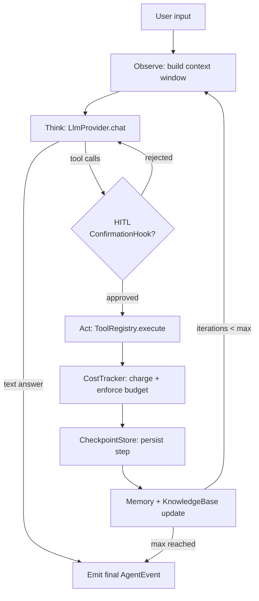
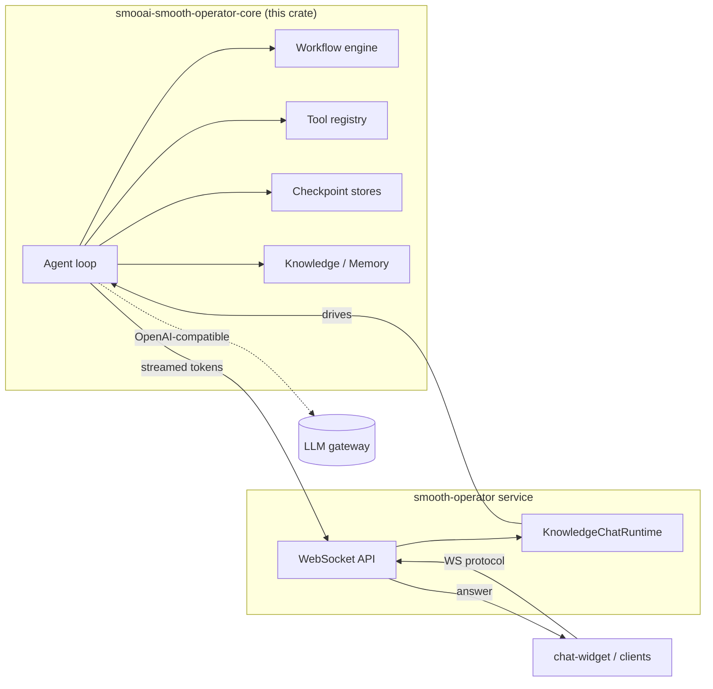
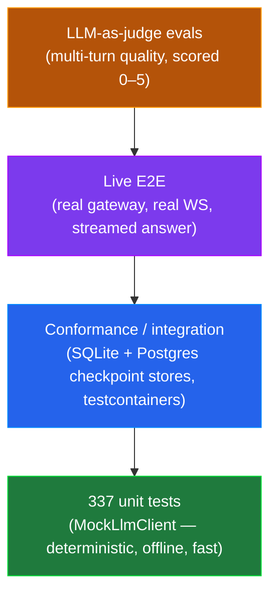

<p align="center">
  
</p>

<p align="center">
  <strong>The Rust engine for orchestrated AI agents.</strong><br/>
  Agents, workflows, tools, checkpointing, memory, human-in-the-loop, and cost tracking — built test-first, in Rust.
</p>

<p align="center">
  <a href="./LICENSE"></a>
  
  
  
  <a href="https://lom.smoo.ai"></a>
</p>

---

`smooai-smooth-operator-core` is the agent runtime that powers the [**smooth-operator**](https://github.com/SmooAI/smooth-operator) service and [**lom.smoo.ai**](https://lom.smoo.ai). It gives you the moving parts of a serious agent framework — an observe→think→act loop, a typed tool system, a graph workflow engine, pluggable checkpoint stores, memory, RAG, human-in-the-loop gates, and per-model cost budgets — as a single, embeddable Rust crate.

Inspired by LangGraph, CrewAI, and Agno, with one hard difference: **it's the engine, not a notebook demo.** Every surface is covered by **337 fast, offline unit tests** built on a deterministic `MockLlmClient`, so the loop is verified — not vibe-coded.

> The Rust implementation is the source of truth. TypeScript, Go, C#/.NET, and Python bindings mirror its surface (protocol-first; see [Repository layout](#repository-layout)).

---

## Quickstart

```toml
# Cargo.toml
[dependencies]
smooai-smooth-operator-core = { git = "https://github.com/SmooAI/smooth-operator-core.git", branch = "main" }
async-trait = "0.1"
tokio = { version = "1", features = ["full"] }
anyhow = "1"
serde_json = "1"
```

Or, once published to crates.io _(publish pending — use the git dep above today)_:

```bash
cargo add smooai-smooth-operator-core
```

A complete agent — one tool, one LLM, one `run()` — in about 40 lines:

```rust
use smooth_operator_core::{Agent, AgentConfig, LlmConfig, Role, Tool, ToolRegistry, ToolSchema};
use async_trait::async_trait;

struct GetWeather;

#[async_trait]
impl Tool for GetWeather {
    fn schema(&self) -> ToolSchema {
        ToolSchema {
            name: "get_weather".into(),
            description: "Get current weather for a city".into(),
            parameters: serde_json::json!({
                "type": "object",
                "properties": { "city": { "type": "string" } },
                "required": ["city"]
            }),
        }
    }

    async fn execute(&self, args: serde_json::Value) -> anyhow::Result<String> {
        let city = args["city"].as_str().unwrap_or("unknown");
        Ok(format!("Weather in {city}: 72F, sunny"))
    }
}

#[tokio::main]
async fn main() -> anyhow::Result<()> {
    // OpenAI-compatible by default — `openrouter()` is a convenience preset.
    // Point `api_url` at OpenAI, an Anthropic-compatible endpoint, or your
    // own gateway (e.g. `https://llm.smoo.ai/v1`).
    let llm = LlmConfig::openrouter(std::env::var("OPENROUTER_API_KEY")?)
        .with_model("openai/gpt-4o");

    let config = AgentConfig::new("assistant", "You are a helpful assistant.", llm)
        .with_max_iterations(10)
        .with_parallel_tools(true);

    let mut registry = ToolRegistry::new();
    registry.register(GetWeather);

    let agent = Agent::new(config, registry);
    let conversation = agent.run("What's the weather in Tokyo?").await?;

    // The final answer is the last assistant message in the returned conversation.
    if let Some(answer) = conversation.messages.iter().rev().find(|m| m.role == Role::Assistant) {
        println!("{}", answer.content);
    }
    Ok(())
}
```

> Note: the LLM client is **OpenAI-compatible**. Point `api_url` at OpenAI, an Anthropic-compatible endpoint, or your own gateway (e.g. `https://llm.smoo.ai/v1`). `run()` returns the full `Conversation`; for live token deltas / tool-call / tool-result events, use `run_with_channel(msg, tx)` and consume the `AgentEvent` stream off the receiver.

---

## Showcase: a checkpointed workflow with HITL and a cost budget

The agent loop is the front door. Underneath, you can compose **stateful workflows**, gate dangerous tool calls behind a **human confirmation hook**, **checkpoint** every step for resume, and cap spend with a **cost budget** — all from the same crate.

```rust
use std::sync::Arc;
use std::time::Duration;
use smooth_operator_core::{
    Agent, AgentConfig, LlmConfig, ToolRegistry,
    MemoryCheckpointStore,
    ConfirmationHook, human_channel, HumanResponse,
    CostBudget,
};

let llm = LlmConfig::openrouter(std::env::var("OPENROUTER_API_KEY")?);
let mut registry = ToolRegistry::new();

// 1. Persist progress so a crashed turn resumes instead of restarting.
//    (Swap in the `sqlite` or `postgres` store for durable, multi-process resume.)
let checkpoints = Arc::new(MemoryCheckpointStore::default());

// 2. Cap spend per session — `CostTracker::check_budget` refuses to exceed it.
let budget = CostBudget { max_cost_usd: Some(0.50), max_tokens: None };

// 3. Gate write/irreversible tools behind a human "yes". The hook fires for
//    any tool whose name contains one of these substrings.
let channels = human_channel();
let confirm = ConfirmationHook::new(
    vec!["delete_".into(), "send_".into()],
    channels.request_tx,
    channels.response_rx,
    Duration::from_secs(300),
);
registry.add_hook(confirm);

// The UI side drives the human loop: read each request, answer it.
let mut requests = channels.request_rx;
let responses = channels.response_tx;
tokio::spawn(async move {
    while let Some(req) = requests.recv().await {
        // Surface `req` to a human (Slack, dashboard, CLI) and answer.
        let _ = responses.send(HumanResponse::Approved);
        // or: HumanResponse::Denied { reason: "not allowed".into() }
    }
});

let config = AgentConfig::new("assistant", "You are a careful assistant.", llm)
    .with_budget(budget);
let agent = Agent::new(config, registry).with_checkpoint_store(checkpoints);
```

`CheckpointStore`, `CostTracker`, and `ConfirmationHook` are **traits + ready-made impls**: start with the in-memory versions, then swap to SQLite/Postgres and a real approval surface without touching your agent code.

---

## Why this

| You want… | smooth-operator-core gives you |
| --- | --- |
| An agent loop you can **trust** | observe→think→act with iteration caps, parallel tool calls, and a typed `AgentEvent` stream |
| **Typed tools** with guardrails | `Tool` trait + `ToolRegistry`, with pre/post hooks for surveillance, secret detection, prompt-injection guards |
| **Stateful graphs** (a LangGraph analog) | `Workflow<S>` / `WorkflowBuilder<S>` with conditional edges and typed state |
| **Resume after a crash** | `CheckpointStore`: in-memory, file, SQLite, or Postgres |
| **RAG + memory** | `KnowledgeBase` / `Memory` traits (with in-memory impls) as clean seams |
| **Humans in the loop** | `ConfirmationHook` + human channels for gated tool calls |
| **Spend control** | per-model `ModelPricing`, `CostBudget`, `CostTracker` with hard enforcement |
| **Offline, deterministic tests** | `LlmProvider` trait + `MockLlmClient` — script responses, assert on requests, no network |
| To **embed it anywhere** | one crate, `provided.al2023`-friendly, runs in a Lambda, a container, or any host process |

It's the runtime the smooth-operator service actually ships on — not a reference design.

---

## Architecture

### The agent loop



Every edge above is a swappable trait: `LlmProvider`, `Tool`/`ToolRegistry`, `ConfirmationHook`, `CostTracker`, `CheckpointStore`, `Memory`, `KnowledgeBase`.

### How the service consumes the engine



The service is thin: it terminates the WebSocket protocol and hands turns to the engine. All the agent intelligence lives here.

---

## Test-driven by default — verified, not vibe-coded

This is the part we care about most. The engine ships **408 unit tests** that run in **seconds, fully offline**, because every LLM call goes through an `LlmProvider` seam that tests satisfy with `MockLlmClient`:

```rust
use smooth_operator_core::llm_provider::{LlmProvider, MockLlmClient};
use smooth_operator_core::conversation::Message;

#[tokio::test]
async fn agent_uses_the_tool_then_answers() {
    let mock = MockLlmClient::new();
    // Script the model: first a tool call, then a final answer.
    mock.push_tool_call("call_1", "get_weather", serde_json::json!({ "city": "Tokyo" }));
    mock.push_text("It's 72F and sunny in Tokyo.");

    // ... drive the agent with `mock` injected as its LlmProvider ...

    // Assert on what the agent actually sent the model — not just the output.
    assert_eq!(mock.call_count(), 2);
    let first = &mock.calls()[0];
    assert!(first.tools.iter().any(|t| t.name == "get_weather"));
}
```

`MockLlmClient` replays scripted text, tool-calls, errors, and streaming events **in FIFO order**, and records every request — so a test can assert on the exact messages and tool schemas the agent sent, not just the final string. Clones share state (`Arc<Mutex<_>>`), so the copy handed to the `Agent` and the handle held by the test see the same script and recordings.

### The test pyramid



- **Unit (408):** the bulk. Loop control, tool dispatch, workflow edges, compaction, cost enforcement, HITL gating, checkpoint round-trips — all against `MockLlmClient`.
- **Conformance:** the `sqlite` and `postgres` checkpoint stores run the same suite against real engines (testcontainers), so "resume" means the same thing everywhere.
- **Live E2E:** the smooth-operator service + [chat-widget](https://github.com/SmooAI/chat-widget) drive a real streamed, knowledge-grounded answer through a live gateway.
- **LLM-as-judge:** multi-turn conversation quality is scored 0–5 by a judge model. This caught a real multi-turn context defect: a regression scored **1/5**, the fix landed, and it went back to **5/5** — a class of bug no assertion-based test would have flagged.

Run them:

```bash
cd rust/smooth-operator-core
cargo test                                   # 337 unit tests, offline
cargo test --features sqlite,postgres        # + checkpoint-store conformance
cargo clippy --all-targets -- -D warnings
```

---

## Cargo features

| Feature | Effect |
| --- | --- |
| `sqlite` | SQLite checkpoint store (`rusqlite`, bundled) |
| `postgres` | Postgres checkpoint store (r2d2 pool) |

---

## Repository layout

This is a multi-language SmooAI package. The Rust crate is the reference; other languages mirror its surface.

| Directory | Language | Status |
| --- | --- | --- |
| [`rust/`](./rust) | Rust (reference) | Active — crate `smooai-smooth-operator-core` (lib `smooth_operator_core`) |
| [`typescript/`](./typescript) | TypeScript | Planned |
| [`go/`](./go) | Go | Planned |
| [`dotnet/`](./dotnet) | C# / .NET | Planned (first-class target) |
| [`python/`](./python) | Python | Planned |

Bindings follow a **protocol-first** strategy (a stable wire spec each language implements natively), with in-process FFI (napi-rs, PyO3/uniffi) layered on where embedding the engine pays off.

---

## Smoo-powered or bring-your-own

**Bring-your-own:** point `LlmConfig.api_url` at any OpenAI-compatible endpoint (OpenAI, an Anthropic-compatible proxy, vLLM, Ollama's OpenAI shim). Provide your own `CheckpointStore`, `Memory`, and `KnowledgeBase` impls. The engine has zero hosted dependencies — it's a library.

**Smoo-powered:** point it at the SmooAI LLM gateway (`https://llm.smoo.ai/v1`) for unified billing, model routing, and cost tracking, and let [**lom.smoo.ai**](https://lom.smoo.ai) run the smooth-operator service for you — no infra to operate.

---

## Links

- [**lom.smoo.ai**](https://lom.smoo.ai) — run it hosted
- [smooth-operator](https://github.com/SmooAI/smooth-operator) — the agent service built on this engine
- [chat-widget](https://github.com/SmooAI/chat-widget) — the embeddable widget that talks to it
- [smoo.ai](https://smoo.ai) — the product · [github.com/SmooAI](https://github.com/SmooAI) — more open source

## License

MIT — see [LICENSE](./LICENSE).
