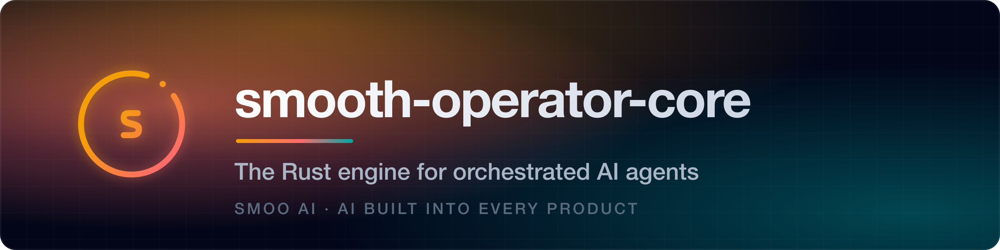
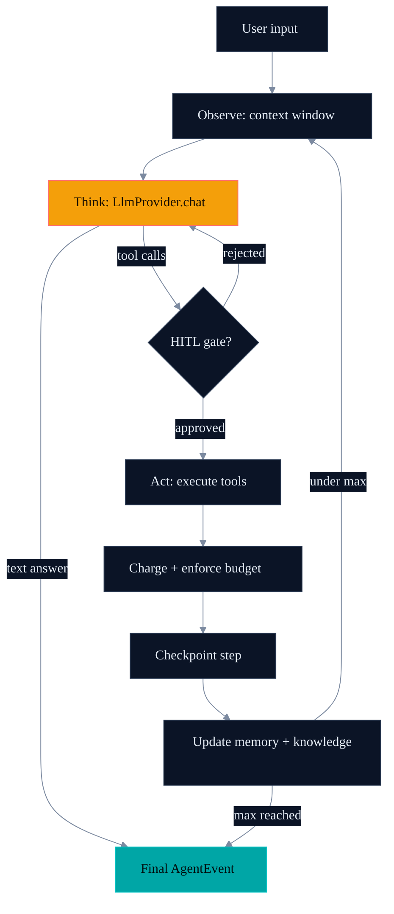
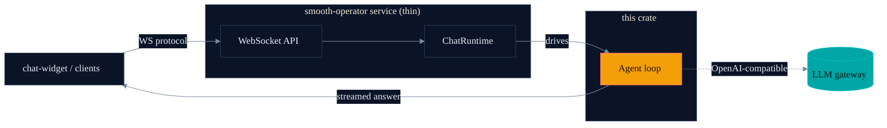
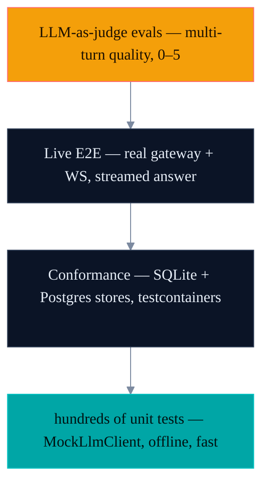

<p align="center">
  <a href="https://smoo.ai"></a>
</p>

<p align="center">
  <a href="https://smoo.ai/th"></a>
  <a href="./LICENSE"></a>
  <a href="https://lom.smoo.ai"></a>
</p>

<p align="center">
  
  
</p>

<p align="center">
  <a href="#why-this"><b>Features</b></a> &nbsp;·&nbsp; <a href="#quickstart"><b>Install</b></a> &nbsp;·&nbsp; <a href="#quickstart"><b>Usage</b></a> &nbsp;·&nbsp; <a href="#architecture"><b>Architecture</b></a> &nbsp;·&nbsp; <a href="#part-of-smoo-ai"><b>Platform</b></a>
</p>

---

> ### The agent brain you can point at production — because you decide what it must never do.
>
> One observe→think→act engine — typed tools, streaming, checkpointing, memory, cost budgets, and a permission gate with hard lines the model can't cross — native in **Rust, TypeScript, Python, Go, and C#**.

Most agent frameworks hand the model a pile of tools and hope for the best. `smooth-operator-core` gives you the whole loop **and the brakes**: a typed tool system with pre/post hooks, human-in-the-loop gates, per-model cost budgets — and a **deny-policy** that lets you draw lines the model can never cross, not even in bypass mode. *No prod AWS profile. No writes to the DB writer. No `rm -rf /`.* Declared once, enforced on every tool call.

It's the runtime that powers the [**smooth-operator**](https://github.com/SmooAI/smooth-operator) service and [**lom.smoo.ai**](https://lom.smoo.ai) — not a notebook demo. Inspired by LangGraph, CrewAI, and Agno, with one hard difference: every surface is covered by **hundreds of fast, offline unit tests** built on a deterministic `MockLlmClient`, so the loop is verified — not vibe-coded. And it's the **same engine in five languages** — write your agent where your stack already lives.

> The Rust implementation is the source of truth. The TypeScript, Python, Go, and C#/.NET ports mirror its surface at parity (protocol-first; see [Repository layout](#repository-layout)).

---

## Quickstart

```toml
# Cargo.toml
[dependencies]
smooai-smooth-operator-core = { git = "https://github.com/SmooAI/smooth-operator-core.git", branch = "main" }
async-trait = "0.1"
tokio = { version = "1", features = ["full"] }
anyhow = "1"
serde_json = "1"
```

Or, once published to crates.io _(publish pending — use the git dep above today)_:

```bash
cargo add smooai-smooth-operator-core
```

A complete agent — one tool, one LLM, one `run()` — in about 40 lines:

```rust
use smooth_operator_core::{Agent, AgentConfig, LlmConfig, Role, Tool, ToolRegistry, ToolSchema};
use async_trait::async_trait;

struct GetWeather;

#[async_trait]
impl Tool for GetWeather {
    fn schema(&self) -> ToolSchema {
        ToolSchema {
            name: "get_weather".into(),
            description: "Get current weather for a city".into(),
            parameters: serde_json::json!({
                "type": "object",
                "properties": { "city": { "type": "string" } },
                "required": ["city"]
            }),
        }
    }

    async fn execute(&self, args: serde_json::Value) -> anyhow::Result<String> {
        let city = args["city"].as_str().unwrap_or("unknown");
        Ok(format!("Weather in {city}: 72F, sunny"))
    }
}

#[tokio::main]
async fn main() -> anyhow::Result<()> {
    // OpenAI-compatible by default — `openrouter()` is a convenience preset.
    // Point `api_url` at OpenAI, an Anthropic-compatible endpoint, or your
    // own gateway (e.g. `https://llm.smoo.ai/v1`).
    let llm = LlmConfig::openrouter(std::env::var("OPENROUTER_API_KEY")?)
        .with_model("openai/gpt-4o");

    let config = AgentConfig::new("assistant", "You are a helpful assistant.", llm)
        .with_max_iterations(10)
        .with_parallel_tools(true);

    let mut registry = ToolRegistry::new();
    registry.register(GetWeather);

    let agent = Agent::new(config, registry);
    let conversation = agent.run("What's the weather in Tokyo?").await?;

    // The final answer is the last assistant message in the returned conversation.
    if let Some(answer) = conversation.messages.iter().rev().find(|m| m.role == Role::Assistant) {
        println!("{}", answer.content);
    }
    Ok(())
}
```

> Note: the LLM client is **OpenAI-compatible**. Point `api_url` at OpenAI, an Anthropic-compatible endpoint, or your own gateway (e.g. `https://llm.smoo.ai/v1`). `run()` returns the full `Conversation`; for live token deltas / tool-call / tool-result events, use `run_with_channel(msg, tx)` and consume the `AgentEvent` stream off the receiver.

---

## Showcase: a checkpointed workflow with HITL and a cost budget

The agent loop is the front door. Underneath, you can compose **stateful workflows**, gate dangerous tool calls behind a **human confirmation hook**, **checkpoint** every step for resume, and cap spend with a **cost budget** — all from the same crate.

```rust
use std::sync::Arc;
use std::time::Duration;
use smooth_operator_core::{
    Agent, AgentConfig, LlmConfig, ToolRegistry,
    MemoryCheckpointStore,
    ConfirmationHook, human_channel, HumanResponse,
    CostBudget,
};

let llm = LlmConfig::openrouter(std::env::var("OPENROUTER_API_KEY")?);
let mut registry = ToolRegistry::new();

// 1. Persist progress so a crashed turn resumes instead of restarting.
//    (Swap in the `sqlite` or `postgres` store for durable, multi-process resume.)
let checkpoints = Arc::new(MemoryCheckpointStore::default());

// 2. Cap spend per session — `CostTracker::check_budget` refuses to exceed it.
let budget = CostBudget { max_cost_usd: Some(0.50), max_tokens: None };

// 3. Gate write/irreversible tools behind a human "yes". The hook fires for
//    any tool whose name contains one of these substrings.
let channels = human_channel();
let confirm = ConfirmationHook::new(
    vec!["delete_".into(), "send_".into()],
    channels.request_tx,
    channels.response_rx,
    Duration::from_secs(300),
);
registry.add_hook(confirm);

// The UI side drives the human loop: read each request, answer it.
let mut requests = channels.request_rx;
let responses = channels.response_tx;
tokio::spawn(async move {
    while let Some(req) = requests.recv().await {
        // Surface `req` to a human (Slack, dashboard, CLI) and answer.
        let _ = responses.send(HumanResponse::Approved);
        // or: HumanResponse::Denied { reason: "not allowed".into() }
    }
});

let config = AgentConfig::new("assistant", "You are a careful assistant.", llm)
    .with_budget(budget);
let agent = Agent::new(config, registry).with_checkpoint_store(checkpoints);
```

`CheckpointStore`, `CostTracker`, and `ConfirmationHook` are **traits + ready-made impls**: start with the in-memory versions, then swap to SQLite/Postgres and a real approval surface without touching your agent code.

---

## Why this

| You want… | smooth-operator-core gives you |
| --- | --- |
| An agent loop you can **trust** | observe→think→act with iteration caps, parallel tool calls, and a typed `AgentEvent` stream |
| **Typed tools** with guardrails | `Tool` trait + `ToolRegistry`, with pre/post hooks for surveillance, secret detection, prompt-injection guards |
| **Deny what must never run** | `PermissionHook` gate (`AutoMode`: ask / accept-edits / deny-unmatched / bypass) + hard circuit-breakers + a consumer `DenyPolicy` (declarative TOML rules + semantic predicates) |
| **Stateful graphs** (a LangGraph analog) | `Workflow<S>` / `WorkflowBuilder<S>` with conditional edges and typed state |
| **Resume after a crash** | `CheckpointStore`: in-memory, file, SQLite, or Postgres |
| **RAG + memory** | `KnowledgeBase` / `Memory` traits (with in-memory impls) as clean seams |
| **Humans in the loop** | `ConfirmationHook` + human channels for gated tool calls |
| **Spend control** | per-model `ModelPricing`, `CostBudget`, `CostTracker` with hard enforcement |
| **Offline, deterministic tests** | `LlmProvider` trait + `MockLlmClient` — script responses, assert on requests, no network |
| To **embed it anywhere** | one crate, `provided.al2023`-friendly, runs in a Lambda, a container, or any host process |

It's the runtime the smooth-operator service actually ships on — not a reference design.

---

## Permissions & deny-policy — draw lines the agent can't cross

Here's the thing that makes an agent safe to point at real infrastructure: **you** decide what it can never do, and no prompt, jailbreak, or model mistake can talk it out of that.

Every tool call passes through a gate before it runs. `AutoMode` sets the baseline posture — read-only calls **allow**, mutating calls **ask**, dangerous calls **deny** — and hard circuit-breakers (`rm -rf /`, credential paths, pipe-to-shell, dangerous domains) fire in *every* mode, `Bypass` included. On top of that you attach a **`DenyPolicy`**: declarative TOML rules for the lines you can name, plus semantic predicates for the ones you can't.

```rust
use std::sync::Arc;
use smooth_operator_core::{Agent, AutoMode, DenyPolicy, DenyPredicate, DenyReason, ToolCall};

// Predicate: the checks strings can't express — is this AWS call the *prod account*?
// Is this DB connection the *writer* endpoint? Return Some(reason) to deny.
struct DenyDbWriter;
impl DenyPredicate for DenyDbWriter {
    fn evaluate(&self, call: &ToolCall) -> Option<DenyReason> {
        (call.name == "db_query" && call.arguments.to_string().contains("writer"))
            .then(|| DenyReason::new("DB writer is off-limits — reads go to the replica"))
    }
}

// Declarative rules: never the prod AWS profile, never a prod host.
let policy = DenyPolicy::from_toml(r#"
    schema_version = 1
    [bash]
    deny_patterns = ["aws * --profile prod"]
    [network]
    deny_hosts = ["*.prod.internal"]
"#)?.with_predicate(Arc::new(DenyDbWriter));

let agent = Agent::new(config, registry)
    .with_permission_mode(AutoMode::Ask)
    .with_deny_policy(Arc::new(policy));
```

A deny-policy match is a **hard deny of circuit-breaker tier** — no stored grant waives it, no mode downgrades it. That's the difference between "we asked the model nicely" and "it structurally cannot." And it's identical across all five languages.

---

## Architecture

### The agent loop



Every edge above is a swappable trait: `LlmProvider`, `Tool`/`ToolRegistry`, `ConfirmationHook`, `CostTracker`, `CheckpointStore`, `Memory`, `KnowledgeBase`.

### How the service consumes the engine



The service is thin: it terminates the WebSocket protocol and hands turns to the engine. All the agent intelligence lives here.

---

## Test-driven by default — verified, not vibe-coded

This is the part we care about most. The engine ships **hundreds of unit tests** that run in **seconds, fully offline**, because every LLM call goes through an `LlmProvider` seam that tests satisfy with `MockLlmClient`:

```rust
use smooth_operator_core::llm_provider::{LlmProvider, MockLlmClient};
use smooth_operator_core::conversation::Message;

#[tokio::test]
async fn agent_uses_the_tool_then_answers() {
    let mock = MockLlmClient::new();
    // Script the model: first a tool call, then a final answer.
    mock.push_tool_call("call_1", "get_weather", serde_json::json!({ "city": "Tokyo" }));
    mock.push_text("It's 72F and sunny in Tokyo.");

    // ... drive the agent with `mock` injected as its LlmProvider ...

    // Assert on what the agent actually sent the model — not just the output.
    assert_eq!(mock.call_count(), 2);
    let first = &mock.calls()[0];
    assert!(first.tools.iter().any(|t| t.name == "get_weather"));
}
```

`MockLlmClient` replays scripted text, tool-calls, errors, and streaming events **in FIFO order**, and records every request — so a test can assert on the exact messages and tool schemas the agent sent, not just the final string. Clones share state (`Arc<Mutex<_>>`), so the copy handed to the `Agent` and the handle held by the test see the same script and recordings.

### The test pyramid



- **Unit (the bulk):** loop control, tool dispatch, workflow edges, compaction, cost enforcement, permission-gate + deny-policy verdicts, HITL gating, checkpoint round-trips — all against `MockLlmClient`.
- **Conformance:** the `sqlite` and `postgres` checkpoint stores run the same suite against real engines (testcontainers), so "resume" means the same thing everywhere.
- **Live E2E:** the smooth-operator service + [chat-widget](https://github.com/SmooAI/chat-widget) drive a real streamed, knowledge-grounded answer through a live gateway.
- **LLM-as-judge:** multi-turn conversation quality is scored 0–5 by a judge model. This caught a real multi-turn context defect: a regression scored **1/5**, the fix landed, and it went back to **5/5** — a class of bug no assertion-based test would have flagged.

Run them:

```bash
cd rust/smooth-operator-core
cargo test                                   # 337 unit tests, offline
cargo test --features sqlite,postgres        # + checkpoint-store conformance
cargo clippy --all-targets -- -D warnings
```

---

## Cargo features

| Feature | Effect |
| --- | --- |
| `sqlite` | SQLite checkpoint store (`rusqlite`, bundled) |
| `postgres` | Postgres checkpoint store (r2d2 pool) |

---

## Repository layout

This is a multi-language SmooAI package. The Rust crate is the reference; the other four are **native ports at parity** — the same engine, idiomatic in each language, held to a shared eval suite. Each ships to its language's registry with its own README landing page. For install commands and a hello-agent example in every language, see [**docs/Polyglot-Engines.md**](./docs/Polyglot-Engines.md).

| Language | Directory | Package | Registry |
| --- | --- | --- | --- |
| Rust (reference) | [`rust/`](./rust/smooth-operator-core) | `smooai-smooth-operator-core` (lib `smooth_operator_core`) | [crates.io](https://crates.io/crates/smooai-smooth-operator-core) |
| TypeScript | [`typescript/`](./typescript/core) | `@smooai/smooth-operator-core` | [npm](https://www.npmjs.com/package/@smooai/smooth-operator-core) |
| Python | [`python/`](./python/core) | `smooai-smooth-operator-core` | [PyPI](https://pypi.org/project/smooai-smooth-operator-core/) |
| Go | [`go/`](./go/core) | `github.com/SmooAI/smooth-operator-core/go/core` | [pkg.go.dev](https://pkg.go.dev/github.com/SmooAI/smooth-operator-core/go/core) |
| C# / .NET | [`dotnet/`](./dotnet/core) | `SmooAI.SmoothOperator.Core` | [nuget.org](https://www.nuget.org/packages/SmooAI.SmoothOperator.Core) |

The ports follow a **protocol-first** strategy: a stable wire spec each language implements natively, so the loop, tool system, permission gate, checkpointing, and cost accounting behave the same everywhere.

---

## Smoo-powered or bring-your-own

**Bring-your-own:** point `LlmConfig.api_url` at any OpenAI-compatible endpoint (OpenAI, an Anthropic-compatible proxy, vLLM, Ollama's OpenAI shim). Provide your own `CheckpointStore`, `Memory`, and `KnowledgeBase` impls. The engine has zero hosted dependencies — it's a library.

**Smoo-powered:** point it at the SmooAI LLM gateway (`https://llm.smoo.ai/v1`) for unified billing, model routing, and cost tracking, and let [**lom.smoo.ai**](https://lom.smoo.ai) run the smooth-operator service for you — no infra to operate.

---

## Links

- [**lom.smoo.ai**](https://lom.smoo.ai) — run it hosted
- [smooth-operator](https://github.com/SmooAI/smooth-operator) — the agent service built on this engine
- [chat-widget](https://github.com/SmooAI/chat-widget) — the embeddable widget that talks to it
- [smoo.ai](https://smoo.ai) — the product · [github.com/SmooAI](https://github.com/SmooAI) — more open source

## Part of Smoo AI

`smooth-operator-core` is built and open-sourced by **[Smoo AI](https://smoo.ai)** — the AI-powered business platform with AI built into every product: CRM, customer support, campaigns, field service, observability, and developer tools.

- 🚀 **Smooth on the platform** — [smoo.ai/th](https://smoo.ai/th)
- 🧰 **More open source from Smoo AI** — [smoo.ai/open-source](https://smoo.ai/open-source)
- 🧩 **Sibling repos** — [smooth-operator](https://github.com/SmooAI/smooth-operator) (the agent service), [@smooai/chat-widget](https://github.com/SmooAI/chat-widget) (the embeddable UI), [@smooai/config](https://github.com/SmooAI/config), [@smooai/logger](https://github.com/SmooAI/logger)

## Contributing

Issues and PRs welcome. Keep the engine test-first: every change ships with the offline `MockLlmClient` coverage that proves the loop still holds.

## License

MIT — see [LICENSE](./LICENSE).

---

<p align="center">
  Built by <a href="https://smoo.ai"><strong>Smoo AI</strong></a> — AI built into every product.
</p>
